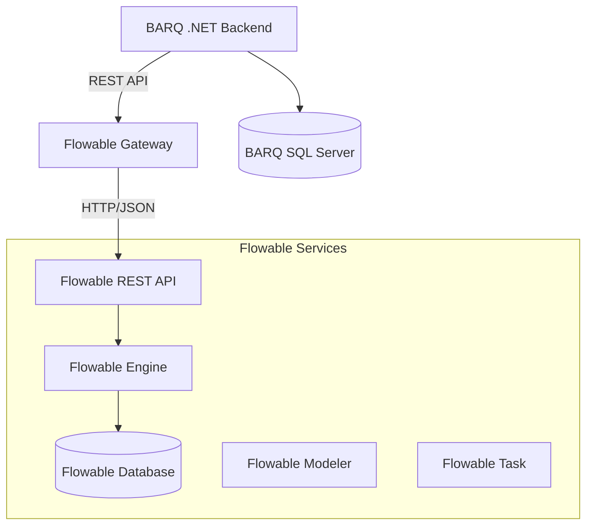

# Flowable REST Integration Specification

## Overview

This document defines the integration contract between BARQ platform and Flowable BPM engine. Flowable is treated as an external Java service accessed via REST API, providing workflow orchestration capabilities for the BARQ platform.

## Architecture



## Authentication

### JWT Pass-through
- BARQ forwards JWT tokens to Flowable via `Authorization: Bearer {token}` header
- Flowable validates tokens using shared secret or public key
- Service account fallback for system operations

### Service Account
- Dedicated service account for BARQ-to-Flowable communication
- Used for deployment operations and system-level tasks
- Credentials stored in BARQ configuration

## Multi-tenancy

### Tenant Propagation
- Custom header `X-Tenant-Id: {tenantId}` sent with all requests
- Flowable process instances tagged with tenant information
- Process definitions can be tenant-specific or shared

### Tenant Isolation
- Process instances filtered by tenant ID
- Task queries scoped to current tenant
- History queries respect tenant boundaries

## Core Endpoints

### Process Deployment
```http
POST /flowable-rest/service/repository/deployments
Content-Type: multipart/form-data
Authorization: Bearer {jwt}
X-Tenant-Id: {tenantId}

Body: BPMN file(s) as ZIP archive
```

### Process Instance Management
```http
# Start Process Instance
POST /flowable-rest/service/runtime/process-instances
Content-Type: application/json
Authorization: Bearer {jwt}
X-Tenant-Id: {tenantId}

{
  "processDefinitionKey": "barq-task-workflow",
  "variables": {
    "taskId": "12345",
    "priority": "high",
    "assignee": "user@example.com"
  }
}

# Get Process Instance
GET /flowable-rest/service/runtime/process-instances/{processInstanceId}
Authorization: Bearer {jwt}
X-Tenant-Id: {tenantId}
```

### Task Management
```http
# Get Tasks
GET /flowable-rest/service/runtime/tasks?assignee={userId}&candidateGroup={groupId}
Authorization: Bearer {jwt}
X-Tenant-Id: {tenantId}

# Claim Task
POST /flowable-rest/service/runtime/tasks/{taskId}
Content-Type: application/json
Authorization: Bearer {jwt}
X-Tenant-Id: {tenantId}

{
  "action": "claim",
  "assignee": "{userId}"
}

# Complete Task
POST /flowable-rest/service/runtime/tasks/{taskId}
Content-Type: application/json
Authorization: Bearer {jwt}
X-Tenant-Id: {tenantId}

{
  "action": "complete",
  "variables": {
    "approved": true,
    "comments": "Task completed successfully"
  }
}
```

### History Queries
```http
# Get Process Instance History
GET /flowable-rest/service/history/historic-process-instances?processInstanceId={id}
Authorization: Bearer {jwt}
X-Tenant-Id: {tenantId}

# Get Task History
GET /flowable-rest/service/history/historic-task-instances?processInstanceId={id}
Authorization: Bearer {jwt}
X-Tenant-Id: {tenantId}
```

### Signals and Events
```http
# Send Signal
POST /flowable-rest/service/runtime/signals
Content-Type: application/json
Authorization: Bearer {jwt}
X-Tenant-Id: {tenantId}

{
  "signalName": "escalation-signal",
  "processInstanceId": "{processInstanceId}",
  "variables": {
    "escalationLevel": 2
  }
}
```

## Error Mapping

### Flowable Error Codes → BARQ ProblemDetails

| Flowable Status | Flowable Error | BARQ Problem Type | BARQ Status |
|----------------|----------------|-------------------|-------------|
| 400 | Bad Request | `validation-error` | 400 |
| 401 | Unauthorized | `authentication-required` | 401 |
| 403 | Forbidden | `authorization-failed` | 403 |
| 404 | Not Found | `resource-not-found` | 404 |
| 409 | Conflict | `resource-conflict` | 409 |
| 500 | Internal Error | `external-service-error` | 502 |

### Example Error Response
```json
{
  "type": "https://barq.example.com/problems/external-service-error",
  "title": "Flowable Service Error",
  "status": 502,
  "detail": "Failed to start process instance: Process definition not found",
  "instance": "/api/workflows/start",
  "flowableError": {
    "message": "No process definition found with key 'invalid-process'",
    "exception": "org.flowable.engine.common.api.FlowableObjectNotFoundException"
  }
}
```

## Resilience Patterns

### Circuit Breaker
- Open circuit after 5 consecutive failures
- Half-open state after 30 seconds
- Close circuit after 3 successful requests

### Retry Policy
- Exponential backoff: 1s, 2s, 4s, 8s
- Maximum 4 retry attempts
- Retry on: 500, 502, 503, 504, timeout
- No retry on: 400, 401, 403, 404, 409

### Timeout Configuration
- Connection timeout: 10 seconds
- Request timeout: 30 seconds
- Long-running operations: 120 seconds

## Health Checks

### Flowable Health Endpoint
```http
GET /flowable-rest/service/management/health
Authorization: Bearer {serviceAccountToken}
```

### BARQ Health Check
- Endpoint: `/health/flowable`
- Checks: Flowable REST API availability, database connectivity
- Response: Healthy/Unhealthy with details

## Logging and Monitoring

### Structured Logging
```json
{
  "timestamp": "2025-08-21T00:20:00Z",
  "level": "Information",
  "message": "Flowable process started",
  "properties": {
    "ProcessDefinitionKey": "barq-task-workflow",
    "ProcessInstanceId": "12345",
    "TenantId": "tenant-123",
    "UserId": "user@example.com",
    "Duration": "1.2s",
    "FlowableRequestId": "req-789"
  }
}
```

### Metrics
- Process start/completion rates
- Task claim/completion times
- Error rates by operation type
- Flowable API response times

## Security Considerations

### Token Validation
- JWT tokens validated by both BARQ and Flowable
- Token expiration handled gracefully
- Refresh token flow for long-running processes

### Data Protection
- Sensitive data masked in logs
- Process variables encrypted at rest
- Audit trail for all operations

### Network Security
- TLS 1.3 for all communications
- Mutual TLS for service-to-service auth
- Network segmentation for Flowable services

## Sample BPMN Process

### Basic Task Workflow
```xml
<?xml version="1.0" encoding="UTF-8"?>
<definitions xmlns="http://www.omg.org/spec/BPMN/20100524/MODEL"
             xmlns:flowable="http://flowable.org/bpmn"
             targetNamespace="http://barq.example.com/workflows">
  
  <process id="barq-task-workflow" name="BARQ Task Workflow" isExecutable="true">
    
    <startEvent id="start" name="Task Created"/>
    
    <userTask id="review-task" name="Review Task" 
              flowable:assignee="${assignee}"
              flowable:candidateGroups="reviewers">
      <documentation>Review and approve the task</documentation>
    </userTask>
    
    <exclusiveGateway id="decision" name="Approved?"/>
    
    <userTask id="rework-task" name="Rework Required"
              flowable:assignee="${assignee}">
      <documentation>Address review comments</documentation>
    </userTask>
    
    <serviceTask id="complete-task" name="Complete Task"
                 flowable:class="com.barq.flowable.CompleteTaskDelegate"/>
    
    <endEvent id="end" name="Task Completed"/>
    
    <!-- Sequence Flows -->
    <sequenceFlow sourceRef="start" targetRef="review-task"/>
    <sequenceFlow sourceRef="review-task" targetRef="decision"/>
    <sequenceFlow sourceRef="decision" targetRef="rework-task">
      <conditionExpression>${!approved}</conditionExpression>
    </sequenceFlow>
    <sequenceFlow sourceRef="decision" targetRef="complete-task">
      <conditionExpression>${approved}</conditionExpression>
    </sequenceFlow>
    <sequenceFlow sourceRef="rework-task" targetRef="review-task"/>
    <sequenceFlow sourceRef="complete-task" targetRef="end"/>
    
  </process>
  
</definitions>
```

## Configuration

### Environment Variables
```bash
# Flowable Connection
FLOWABLE_BASE_URL=http://flowable-rest:8080
FLOWABLE_SERVICE_ACCOUNT_TOKEN=eyJ0eXAiOiJKV1Q...
FLOWABLE_TIMEOUT_SECONDS=30

# Circuit Breaker
FLOWABLE_CIRCUIT_BREAKER_FAILURE_THRESHOLD=5
FLOWABLE_CIRCUIT_BREAKER_TIMEOUT_SECONDS=30

# Retry Policy
FLOWABLE_RETRY_COUNT=4
FLOWABLE_RETRY_DELAY_SECONDS=1
```

### Docker Compose Integration
```yaml
services:
  flowable-rest:
    image: flowable/flowable-rest:6.8.0
    environment:
      - FLOWABLE_DATABASE_URL=jdbc:sqlserver://sqlserver:1433;databaseName=flowable
      - FLOWABLE_DATABASE_USERNAME=sa
      - FLOWABLE_DATABASE_PASSWORD=${DB_PASSWORD}
    ports:
      - "8080:8080"
    depends_on:
      - sqlserver
    healthcheck:
      test: ["CMD", "curl", "-f", "http://localhost:8080/flowable-rest/service/management/health"]
      interval: 30s
      timeout: 10s
      retries: 3
```

This specification provides the foundation for integrating BARQ with Flowable BPM engine while maintaining security, multi-tenancy, and observability requirements.
